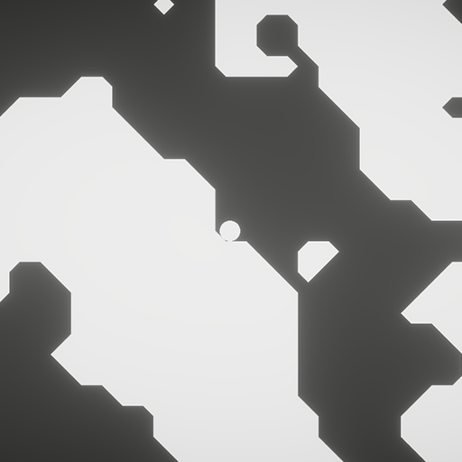
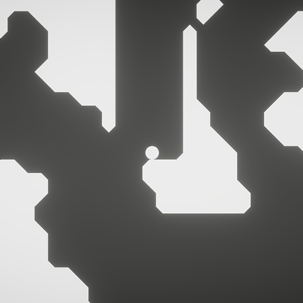
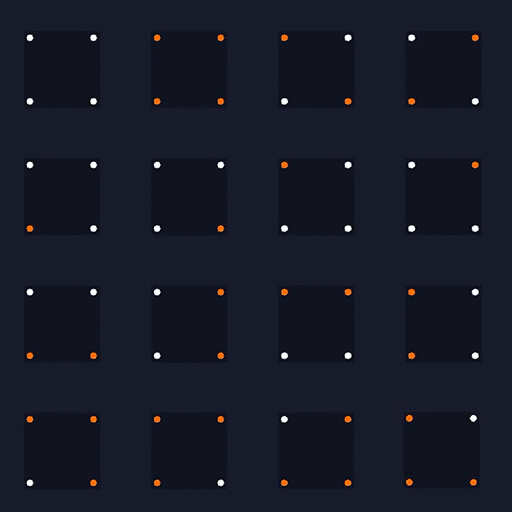

# ⏹️ Scaler Field 2D 📐

**'Polygonization of a Scaler Field In Real-Time Using Compute Shaders In Unity'**

---

Marching squares is an algorithm that can take a field of points and generate a mesh around them. This project aimed to be able to compute and render these points as a mesh while also being able to destroy them in real-time.

This project had me optimize my code using the GPU to parallelize the process of calculating a mesh. My implementation allows for thousands of triangles to be generated and manipulated in real time, maintaining smooth frame rates and enabling complex terrain interactions without compromising performance.

---

  
  
  

